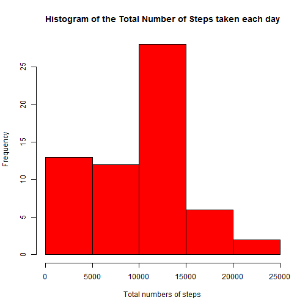
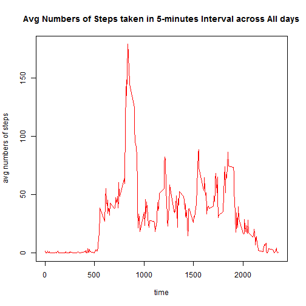
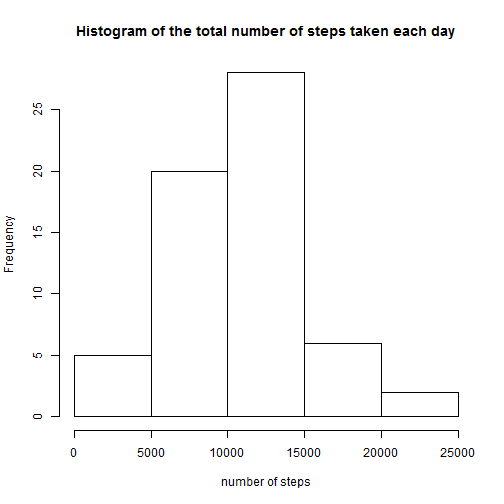
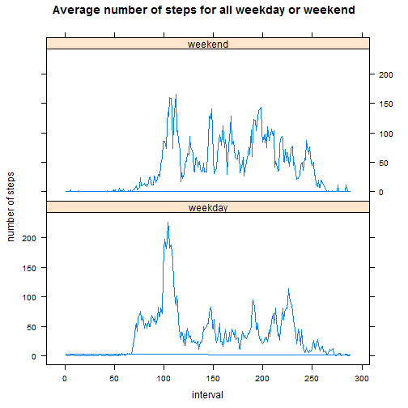

Reproductible Research : Peer Assessment 1

Loading and preprocessing the data 


Q1) What is mean total number of steps taken per day?


```r
#read a file
myData <- read.csv("activity.csv")

#calculate the total number of stpes taken each day
step_sum <- tapply(myData$steps,myData$date,sum,na.rm=TRUE,simplify=TRUE)

#draw a histogram
hist(step_sum,xlab="Total numbers of steps",main="Histogram of the Total Number of Steps taken each day",col="red")
```

 

```r
#calculate the value of mean
mean <- mean(step_sum)

#calculate the value of median
median <- median(step_sum)
```

The mean is 9354.2295 and the median is 10395.


Q2)What is the average daily activity pattern?


```r
#coerin interval as a factor
myData$interval <- as.factor(myData$interval)

#arrange date withouth repeats
date <- levels(myData$date)

#calculate averages of steps and interval based on dates
step_avg <- tapply(myData$steps,myData$interval,sum,na.rm=TRUE,simplify=TRUE)/length(date)


#draw a plot 
plot(x=levels(myData$interval),y=step_avg,type="l",xlab="time",ylab="avg numbers of steps",
     main="Avg Numbers of Steps taken in 5-minutes Interval across All days",col="red")
```

 

```r
#find the maximum of averages of steps
names(which.max(step_avg))
```

```
## [1] "835"
```


Q3) Imputing missing values


```r
#calculate the number of missing values
sum(is.na(myData$steps))
```

```
## [1] 2304
```

```r
#arragne dates without repeats
date <- levels(myData$date)

#calculate averages of steps and interval based on dates
step_avg <- tapply(myData$steps,myData$interval,sum,na.rm=TRUE,simplify=TRUE)/length(date)

#read the number of row based on steps
for (i in 1:length(myData$steps)) {

#read the number of steps having missing values
  if(is.na(myData$steps[i])) {
    
#repeatedly read until the length of step_avg
    for(j in 1:length(step_avg)) {
      
#if the value of       ??????????????????????????????
      if(as.character(myData$interval[i]) == names(step_avg[j]))
#steps having a missing value has been filled in an avg of step        
        myData$steps[i] = step_avg[j]
      
    }
  }
}
#save above stored data
clean_data <- myData

#calcualte the new total number steps based on dates
clean_step_sum <- tapply(clean_data$steps,clean_data$date,sum,na.rm=TRUE,simplify=TRUE)

#draw a histogram 
hist(clean_step_sum, xlab="number of steps", main="Histogram of the total number of steps taken each day")
```

 

```r
#find a mean of clean_step_sum
mean(clean_step_sum)
```

```
## [1] 10581
```

```r
#find a median of clean_step_sum
median(clean_step_sum)
```

```
## [1] 10395
```


Q4) Are there diffences in activity patterns between weekdays and weekends?


```r
library(lattice)
```

```
## Warning: package 'lattice' was built under R version 3.1.1
```

```r
library(datasets)

#read all date
weekday <- weekdays(as.Date(clean_data$date,"%m/%d/%Y")) 
#write.csv(weekday,"newactivity.csv")

#separate date between weekend and weekday
for (i in 1:length(weekday)) { 
  if((weekday[i] == "Saturday") | (weekday[i] == "Sunday")) {
      weekday[i]="weekend"
  }else {
      weekday[i]="weekday"
  }
}

#set up weekday data as factors
clean_data$weekday <- as.factor(weekday)

#divide clean_data into weekday groups
clean_data2 <- split(clean_data,clean_data$weekday)

#save weekday and weekend data
weekday <- clean_data2$weekday
weekend <- clean_data2$weekend

#calculate averages of steps and interval based on weekdays
step_avg_weekday <- tapply(weekday$steps,weekday$interval,sum,simplify=TRUE)/(length(weekday$weekday)/288)

#calculate averages of steps and interval based on weekends
step_avg_weekend <- tapply(weekend$steps,weekend$interval,sum,simplify=TRUE)/(length(weekend$weekday)/288)

#set up the data frame of steps and interval 
output <- data.frame(steps=c(step_avg_weekday,step_avg_weekend), interval=c(clean_data$interval,clean_data$interval),weekday=as.factor(c(rep("weekday",length(step_avg_weekday)),
                     rep("weekend",length(step_avg_weekend)))))

#draw a plot based on the number of steps filled in step_avg and interval    
xyplot(steps~interval | weekday,data=output,layout=c(1,2),ylab="number of steps",
       main="Average number of steps for all weekday or weekend",type="l")
```

 
